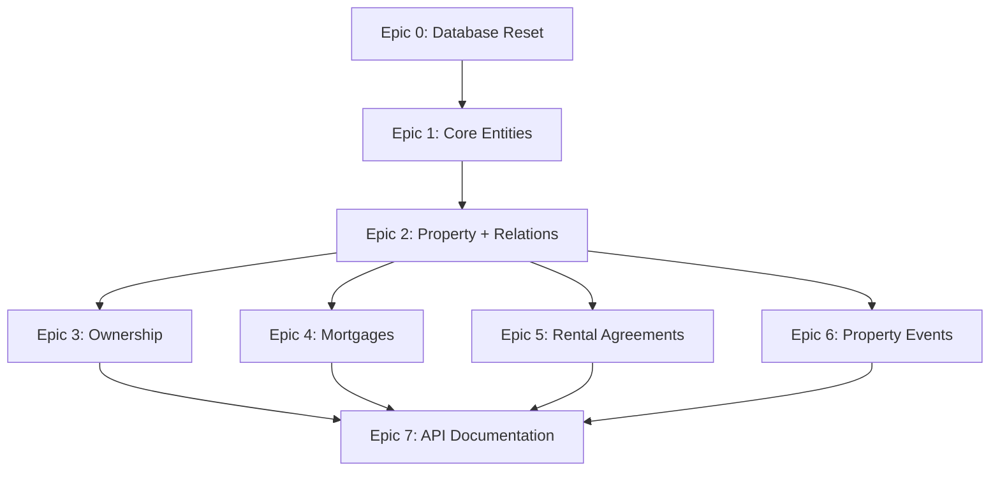

# תוכנית בנייה מחדש מלאה של Backend

## 🎯 מטרה

מחיקה מלאה של הדאטה בייס והקוד הקיים, ובניית מערכת ניהול נדל"ן חדשה עם 8 ישויות מרכזיות ו-4 סוגי אירועים פולימורפיים.

## 📊 מודל הנתונים

### ישויות מרכזיות (8)

> **הערה חשובה**: אין ישות Unit. כל דירה/יחידה מיוצגת כ-Property נפרד. 2 דירות באותה כתובת = 2 Property שונים.

1. **Person** - בני אדם/חברות
2. **BankAccount** - חשבונות בנק (1:1 עם Person)
3. **Property** - נכסים (כולל דירות בבניין - כל דירה = Property נפרד)
4. **PlanningProcessState** - מצב תכנוני (1:1 עם Property)
5. **UtilityInfo** - מידע תפעולי (1:1 עם Property)
6. **Ownership** - טבלת קישור Person ↔ Property
7. **Mortgage** - משכנתאות/הלוואות
8. **RentalAgreement** - הסכמי שכירות (קשור ל-Property ישירות)

### אירועים פולימורפיים (4)

- PropertyEvent (Single Table Inheritance)
  - ValuationEvent
  - ExpenseEvent
  - IncomeEvent
  - MaintenanceEvent

## 🗂️ תיעוד מוכן

הסוכנים יצרו:

- `[docs/project_management/REBUILD_EPICS_OVERVIEW.md](docs/project_management/REBUILD_EPICS_OVERVIEW.md)` - סקירת כל ה-epics
- 8 קבצי epic מפורטים (EPIC_00 עד EPIC_07)
- Schema מלא: `[apps/backend/prisma/schema.domain.prisma](apps/backend/prisma/schema.domain.prisma)`

## ⚠️ התאמות נדרשות

### הסרת Account (Multi-tenancy)

הschema הנוכחי כולל `Account` למולטי-טננסי, אבל ציינת שאין account בשלב זה.

**שינויים נדרשים:**

1. הסרת model `Account` מה-schema
2. הסרת `accountId` מכל המודלים
3. הסרת relation `account` מכל המודלים
4. עדכון כל ה-epics להסיר התייחסות ל-account isolation

### התאמת PropertyEvent

הדומיין שתיארת כולל 4 סוגי אירועים:

- **PlanningProcessEvent** (תהליך תכנוני)
- **PropertyDamageEvent** (תקלות)
- **ExpenseEvent** (הוצאות)
- **RentalPaymentRequestEvent** (בקשות תשלום שכירות)

הschema הנוכחי שונה מעט - צריך להתאים.

## 📋 שלבי הביצוע

### Phase 1: ניקוי והכנה (ידני)

**מה למחוק:**

```bash
# 1. מחיקת כל modules (מלבד תשתיות)
rm -rf apps/backend/src/modules/accounts
rm -rf apps/backend/src/modules/bank-accounts
rm -rf apps/backend/src/modules/dashboard
rm -rf apps/backend/src/modules/export
rm -rf apps/backend/src/modules/financials
rm -rf apps/backend/src/modules/import
rm -rf apps/backend/src/modules/investment-companies
rm -rf apps/backend/src/modules/leases
rm -rf apps/backend/src/modules/mortgages
rm -rf apps/backend/src/modules/notifications
rm -rf apps/backend/src/modules/owners
rm -rf apps/backend/src/modules/ownerships
rm -rf apps/backend/src/modules/plot-info
rm -rf apps/backend/src/modules/properties
rm -rf apps/backend/src/modules/tenants
rm -rf apps/backend/src/modules/units
rm -rf apps/backend/src/modules/valuations

# 2. מחיקת Auth (לפי דרישה)
rm -rf apps/backend/src/modules/auth

# 3. מחיקת table configurations
rm -rf apps/backend/src/table-configurations

# 4. מחיקת schema ו-migrations
rm -rf apps/backend/prisma/migrations
rm apps/backend/prisma/schema.prisma
rm apps/backend/prisma/seed.ts

# 5. מחיקת tests ישנים
rm -rf apps/backend/test/e2e
```

**מה לשמור:**

- `[apps/backend/src/main.ts](apps/backend/src/main.ts)` - נקודת כניסה
- `[apps/backend/src/app.module.ts](apps/backend/src/app.module.ts)` - ינוקה ויעודכן
- `[apps/backend/src/config/](apps/backend/src/config/)` - תצורות
- `[apps/backend/src/database/](apps/backend/src/database/)` - Prisma service
- `[apps/backend/Dockerfile](apps/backend/Dockerfile)` - CI/CD
- `[.github/workflows/deploy-to-gcp.yml](.github/workflows/deploy-to-gcp.yml)` - CI/CD
- `[apps/backend/package.json](apps/backend/package.json)` - dependencies
- `[apps/backend/tsconfig.json](apps/backend/tsconfig.json)` - TypeScript config

### Phase 2: הכנת Schema חדש

1. **התאמת Schema**
  - קובץ: `[apps/backend/prisma/schema.domain.prisma](apps/backend/prisma/schema.domain.prisma)`
  - הסרת model `Account`
  - הסרת כל שדות `accountId`
  - הסרת כל relations ל-`account`
  - התאמת PropertyEvent לדומיין (4 הסוגים שתיארת)
  - הוספת כל השדות שפרטת (גודל מחסן, סוג חניה, וכו')
2. **העתקה ל-Schema ראשי**

```bash
   cp apps/backend/prisma/schema.domain.prisma apps/backend/prisma/schema.prisma
  

```

1. **יצירת Migration ראשון**

```bash
   cd apps/backend
   npx prisma migrate dev --name init_new_domain
   npx prisma generate
  

```

1. **יצירת Seed חדש**
  - קובץ: `[apps/backend/prisma/seed.ts](apps/backend/prisma/seed.ts)`
  - נתוני דמו לכל 8 הישויות

### Phase 3: עדכון app.module.ts

קובץ: `[apps/backend/src/app.module.ts](apps/backend/src/app.module.ts)`

```typescript
import { Module } from '@nestjs/common';
import { ConfigModule } from '@nestjs/config';
import configuration from './config/configuration';
import { DatabaseModule } from './database/database.module';

@Module({
  imports: [
    ConfigModule.forRoot({
      isGlobal: true,
      load: [configuration],
      envFilePath: ['.env.local', '.env'],
    }),
    DatabaseModule,
    // Modules will be added as we implement epics
  ],
  controllers: [],
  providers: [],
})
export class AppModule {}
```

### Phase 4: התאמת Epics

עדכון כל 8 קבצי Epic להסיר:

- התייחסות ל-`Account`
- שדה `accountId`
- Account isolation tests
- Authentication guards

### Phase 5: ביצוע Epics עם Subagents

**סדר ביצוע:**




#### Epic 0: Database Reset & Infrastructure (ידני)

- מחיקת DB, schema, migrations
- יצירת schema חדש
- הרצת migration
- יצירת seed
- וידוא CI/CD עובד

#### Epic 1: Core Entities (Person, BankAccount)

```bash
# לאחר Epic 0, להריץ:
implement-epic 01
```

**משימות:**

- US1.1: Person entity (CRUD + tests)
- US1.2: BankAccount entity (CRUD + tests)
- US1.3: Person-BankAccount relationship

#### Epic 2: Property & 1:1 Relations

```bash
implement-epic 02
```

**משימות:**

- US2.1: Property entity (CRUD + tests)
- US2.2: PlanningProcessState (1:1 with Property)
- US2.3: UtilityInfo (1:1 with Property)

#### Epic 3: Ownership (Many-to-Many)

```bash
implement-epic 03
```

**משימות:**

- US3.1: Ownership junction entity (CRUD + tests)
- US3.2: Property-Person relationships via Ownership

#### Epic 4: Mortgages & Loans

```bash
implement-epic 04
```

**משימות:**

- US4.1: Mortgage entity (CRUD + tests)
- US4.2: Mortgage-Property relationship (optional FK)
- US4.3: Mortgage-Person relationships
- US4.4: Mortgage-BankAccount relationship

#### Epic 5: Rental Agreements

```bash
implement-epic 05
```

**משימות:**

- US5.1: RentalAgreement entity (CRUD + tests)
- US5.2: RentalAgreement-Property relationship (ישירות, ללא Unit)
- US5.3: RentalAgreement-Person (tenant) relationship

#### Epic 6: Property Events (Polymorphic)

```bash
implement-epic 06
```

**משימות:**

- US6.1: PropertyEvent base entity (Single Table Inheritance)
- US6.2: PlanningProcessEvent
- US6.3: PropertyDamageEvent
- US6.4: ExpenseEvent
- US6.5: RentalPaymentRequestEvent
- US6.6: Query by event type

#### Epic 7: API Documentation

```bash
implement-epic 07
```

**משימות:**

- US7.1: Swagger/OpenAPI setup
- US7.2: Document all endpoints
- US7.3: API usage examples
- US7.4: Generate static docs

### Phase 6: בדיקה סופית

**תסריטי בדיקה:**

1. הרצת כל ה-unit tests

```bash
   cd apps/backend
   npm test
  

```

1. הרצת כל ה-API tests

```bash
   npm run test:e2e
  

```

1. בדיקת coverage

```bash
   npm run test:cov
  

```

1. בדיקת build

```bash
   npm run build
  

```

1. בדיקת CI/CD pipeline
  - Push to git → trigger GitHub Actions
  - וידוא deployment ל-Cloud Run עובד

## 📝 תיעוד API

במקביל לפיתוח, ייווצר תיעוד מקיף:

### מבנה התיעוד

```
docs/api/
├── README.md              - סקירה כללית
├── person.md             - Person API
├── bank-account.md       - BankAccount API
├── property.md           - Property API (כל דירה = property נפרד)
├── planning-state.md     - PlanningProcessState API
├── utility-info.md       - UtilityInfo API
├── ownership.md          - Ownership API
├── mortgage.md           - Mortgage API
├── rental-agreement.md   - RentalAgreement API
└── property-event.md     - PropertyEvent API (כל 4 הסוגים)
```

### תוכן כל קובץ תיעוד

- סקירת הישות
- endpoints זמינים (CRUD)
- דוגמאות request/response
- שדות חובה/אופציונליים
- validation rules
- error codes
- דוגמאות שימוש (curl, JavaScript)

## 🔧 כלי עזר

### סקריפטים שימושיים

**מחיקת DB והתחלה מחדש:**

```bash
cd apps/backend
npm run db:reset:force
npx prisma migrate dev --name init_new_domain
npm run prisma:seed
```

**יצירת module חדש:**

```bash
nest g module modules/person
nest g controller modules/person
nest g service modules/person
```

**הרצת dev server:**

```bash
npm run start:dev
```

## ⏱️ הערכת זמן


| Epic     | סיבוכיות | זמן משוער      | User Stories            |
| -------- | -------- | -------------- | ----------------------- |
| Epic 0   | Medium   | 2-3 hours      | 5 (ידני)                |
| Epic 1   | Medium   | 4-6 hours      | 6                       |
| Epic 2   | High     | 5-7 hours      | 7 (הוסרה US Unit)       |
| Epic 3   | Medium   | 4-6 hours      | 6                       |
| Epic 4   | High     | 6-8 hours      | 8                       |
| Epic 5   | Medium   | 5-7 hours      | 7 (Property במקום Unit) |
| Epic 6   | High     | 6-8 hours      | 7                       |
| Epic 7   | Low      | 2-3 hours      | 4                       |
| **סה"כ** | -        | **34-48 שעות** | **50 stories**          |


## 🎯 נקודות קריטיות

### 1. Schema Alignment

- ✅ Schema נוצר אבל דורש התאמות
- ⚠️ צריך להסיר Account (multi-tenancy)
- ⚠️ צריך להתאים PropertyEvent ל-4 הסוגים שתיארת
- ⚠️ צריך להוסיף שדות שחסרים (גודל מחסן, סוג חניה, וכו')

### 2. CI/CD Preservation

- ✅ Dockerfile קיים ויישמר
- ✅ GitHub Actions workflow קיים ויישמר
- ⚠️ צריך לוודא שה-build עובד אחרי השינויים

### 3. Testing Strategy

- כל CRUD operation צריך unit test + API test
- Coverage target: ≥80% for services
- E2E tests per user story

### 4. API Documentation

- Swagger/OpenAPI מובנה ב-NestJS
- תיעוד נרחב בעברית
- דוגמאות לכל endpoint

## 🚀 התחלה

לאחר אישור התוכנית:

1. **הפעלת ניקוי ידני (Phase 1)**
  - מחיקת modules, migrations, schema ישנים
2. **התאמת Schema (Phase 2)**
  - עדכון schema.domain.prisma
  - הסרת Account
  - התאמת PropertyEvent
  - הוספת שדות חסרים
3. **הפעלת Epic 0 ידנית (Phase 2-3)**
  - יצירת migration, seed
  - עדכון app.module.ts
4. **הפעלת Epics 1-7 עם automation**
  - שימוש ב-implement-epic לכל epic
  - subagents יעבדו במקביל כמה שיותר

## 📌 הערות חשובות

1. **ללא Authentication**: אין guards, אין JWT, אין Google OAuth
2. **ללא Account Isolation**: כל הנתונים גלובליים
3. **ללא Frontend**: רק backend + API documentation
4. **שמירת CI/CD**: Docker + GitHub Actions נשמרים
5. **בדיקות מקיפות**: unit tests + API tests לכל ישות

